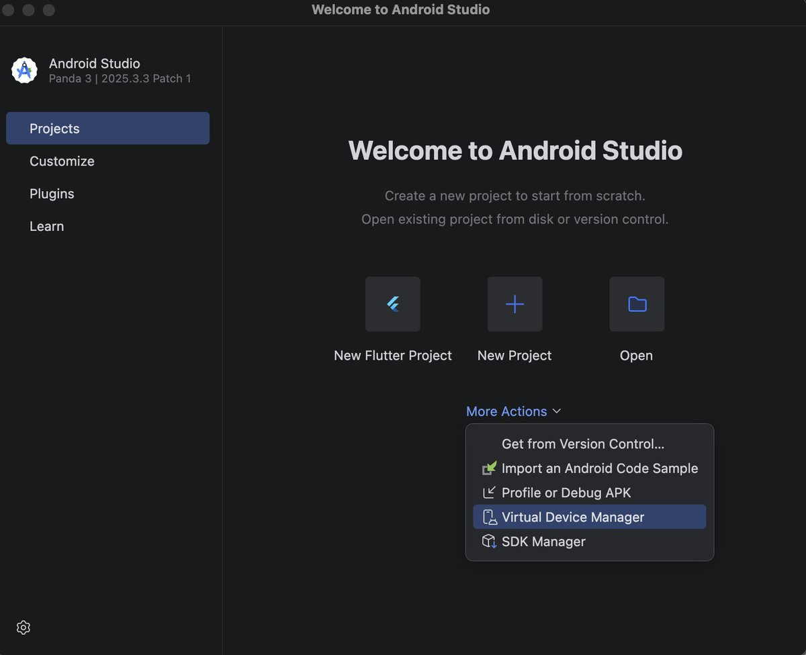
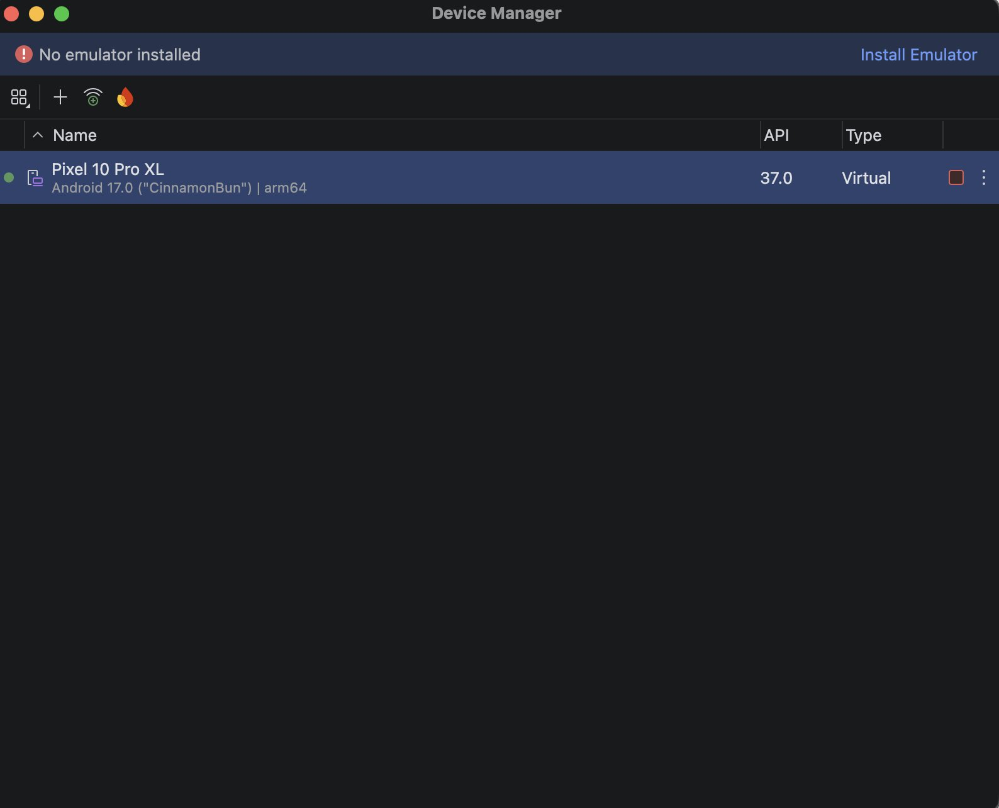
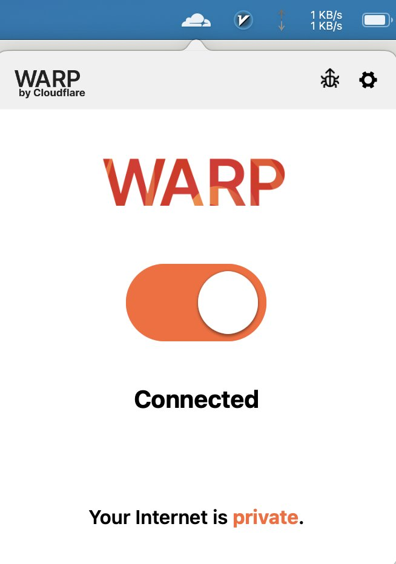
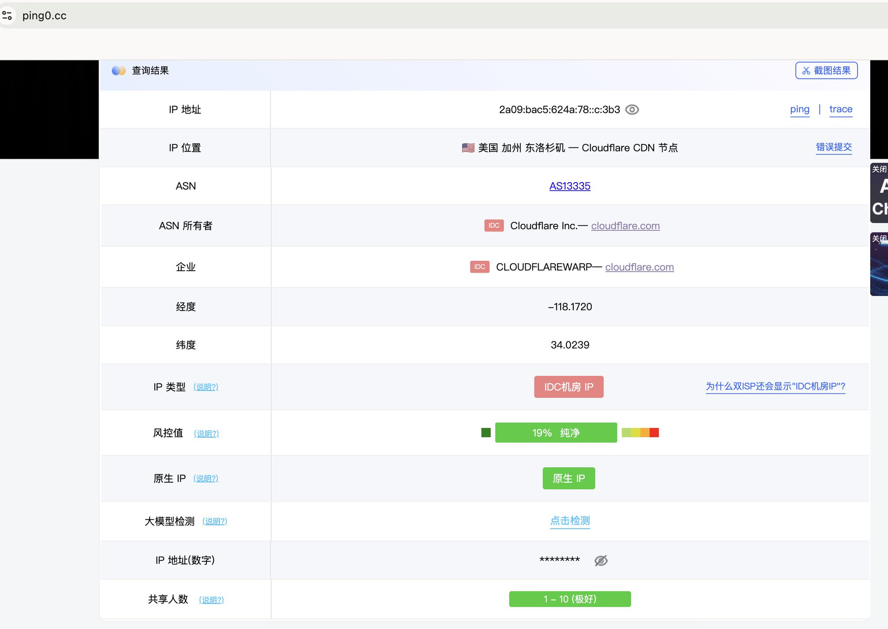
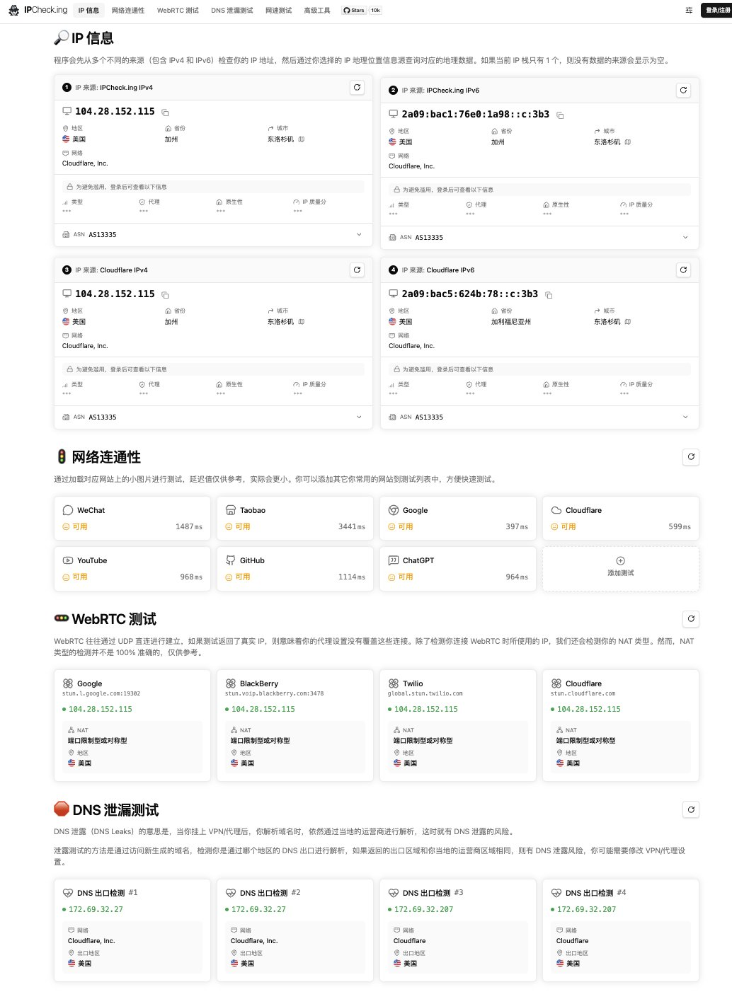
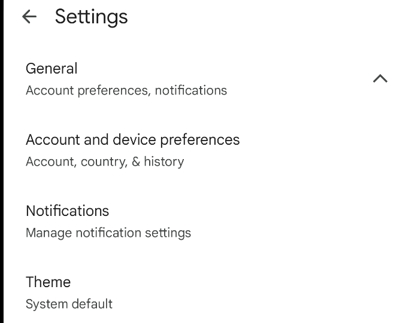
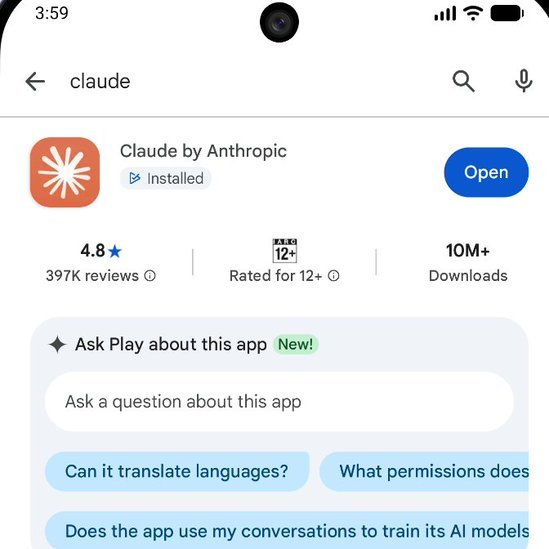
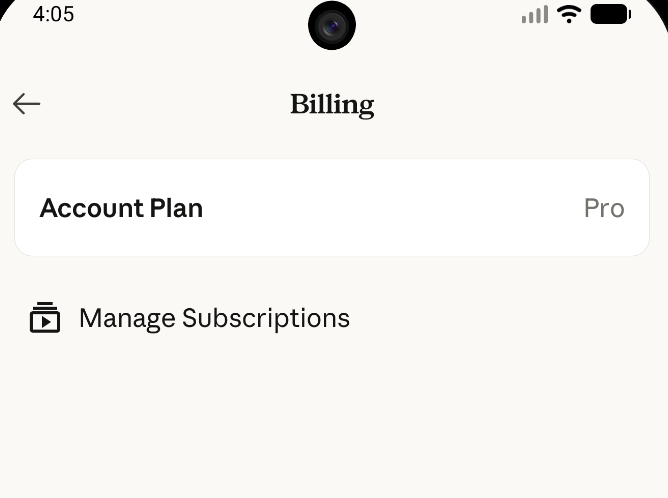

最近想订阅 Claude Pro 试试。

结果在网上找资料时，乱七八糟看了一大堆：又是中转，又是家宽落地，看得人头大。最后，我还是成功用上了官方套餐。

而且不需要中转，也不需要家宽。你只需要准备一张外币信用卡，`VISA` 或 `MasterCard` 都可以。我自己用的是招商银行的 `MasterCard`。

另外，你还需要一个能正常使用的 Claude Free 账号。关于 Claude 账号注册、手机验证码这些步骤，本文就不展开了。

需要额外说明的是，这篇文章更偏向我的个人实操记录，不代表官方承诺的标准路径。账号地区、支付方式和网络环境都有风控风险，是否尝试请自行判断。

## 第一步：安装 Android Studio 并创建虚拟机

先下载安装 `Android Studio`，然后使用 `Virtual Device Manager` 新建一台安卓虚拟机。

这里我更推荐直接用 `Android Studio`，尽量不要用网上那些蓝叠、MuMu 之类的模拟器。原因很简单：`Android Studio` 创建出来的是原生 Google 系统，其他模拟器或多或少都有一些魔改，用原生系统更省事，更省心。

上图是我创建好的安卓虚拟机。最上面的警告可以先忽略，我这里其实已经安装好了模拟器，那个提示大概只是缓存没有刷新。

不过如果你是第一次安装，还是要先点击右上角的 `Install Emulator`，然后按提示一步步安装。它让你装什么就装什么，整体流程并不复杂。

## 第二步：准备网络环境

安装好虚拟机以后，下一步就是先把网络环境处理好。

众所周知，Anthropic 对 IP 环境比较敏感。我一开始换了好几个节点，Claude 的 Android App 都没法正常登录。最后没办法，我试了一下 `Cloudflare WARP`，结果反而成功了。

`Cloudflare WARP` 官方下载地址：

[https://developers.cloudflare.com/cloudflare-one/team-and-resources/devices/cloudflare-one-client/download/](https://developers.cloudflare.com/cloudflare-one/team-and-resources/devices/cloudflare-one-client/download/)

根据你自己的操作系统，下载对应版本安装即可。我这边安装的是 macOS 版本。

安装好以后，建议先把其他代理工具关掉，至少把 `TUN` 模式或者增强模式退出，然后再打开 `WARP`。它的界面很简单，基本就是一个大按钮，打开就能用。

## 第三步：检查当前出口 IP

`WARP` 打开以后，可以先测试一下当前出口 IP。

我这里用的是 `ping0.cc`，主要是为了确认当前出口是不是美国 IP。至于它显示的风险值之类的信息，大家看看就好，不用太当真。

保险起见，我又去 [https://ipcheck.ing](https://ipcheck.ing) 检查了一遍。可以看到，当时我的出口已经是洛杉矶 IP 了。

## 第四步：切换 Google Play 地区

接下来打开安卓虚拟机，登录自己的 Google 账号。

这里要注意一点：你需要把 `Google Play` 切换到支持 Claude 的地区，比如新加坡、泰国、日本、美国等等。

切换 `Google Play` 地区的大致路径是：

打开 `Play Store`，点击右上角头像，滑到最下面进入 `Settings`，展开 `General`，然后进入账号、国家或地区相关设置。

如果你最近 90 天内没有切换过国家/地区，这里通常会提示你切换到新的 `Play` 商店。接着按照提示添加信用卡，把你的外币卡绑定上去就行。比如我这里绑定的是招行万事达卡。

PS：换区这件事主要针对已经绑定过银行卡的账号。比如我的账号以前绑过银联卡，所以默认锁在国区；这种情况下就需要先切区。

如果你的 Google 账号从来没有绑定过银行卡，那么在合适的网络环境下登录后，直接绑卡即可，默认就可能进入对应地区。

## 第五步：安装 Claude 并升级 Pro

前面这些准备都完成以后，后面的流程就比较简单了。

直接在 `Google Play` 搜索 `Claude by Anthropic`，下载安装。安装完成后，打开 App，然后登录你自己的 Claude 账号。

我自己的体验是：如果使用一些普通机房节点，登录时很容易报错 `An error has occurred`；但切到 `Cloudflare WARP` 之后，就可以直接正常登录。

至少就我这次通过 `Google Play` 订阅的经历来看，并不需要额外准备家宽，静态住宅IP之类的代理。

登录成功以后，点击 `Upgrade`，然后按提示升级到 `Pro` 订阅即可，整个扣费流程还是挺丝滑的。

我认为这一套流程中，最关键的就是要使用 cloudflare warp，warp 的出口虽然说是一个机房IP，但是比很多所谓的 `家宽` 要干净多了，后续使用时，也都在 warp 开启的情况下使用，我想试试看这个号能撑多久。

## 最后

如果你已经有：

- 一个能正常使用的 Claude 账号
- 一张可用的外币信用卡

那么通过 `Google Play` 订阅 Claude Pro，整体并没有想象中那么复杂。
