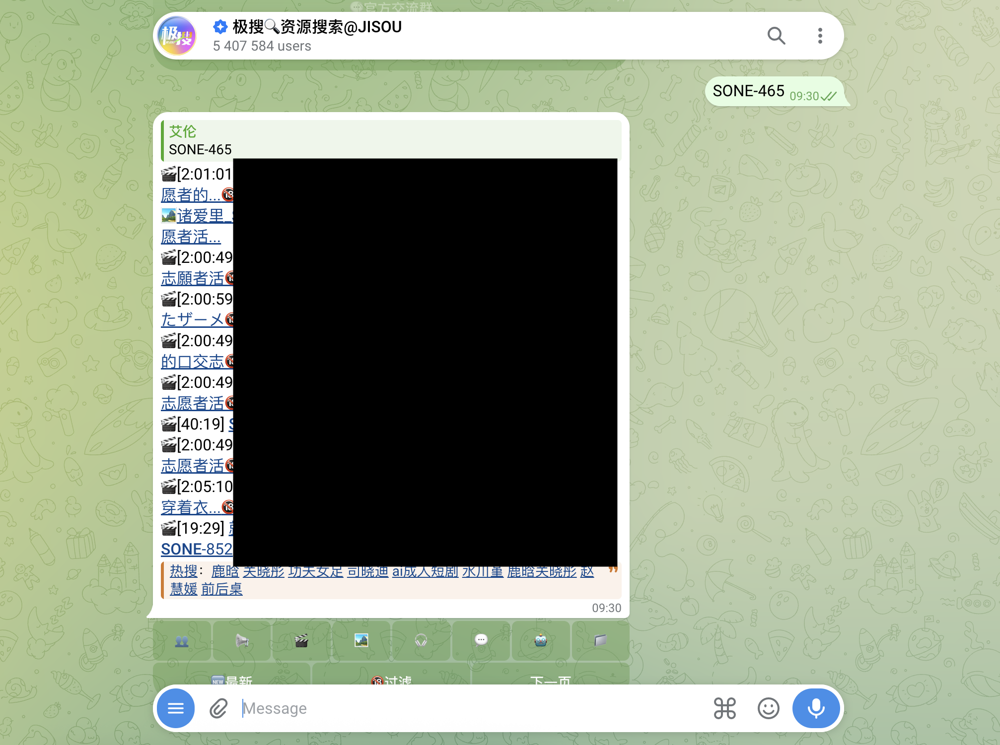
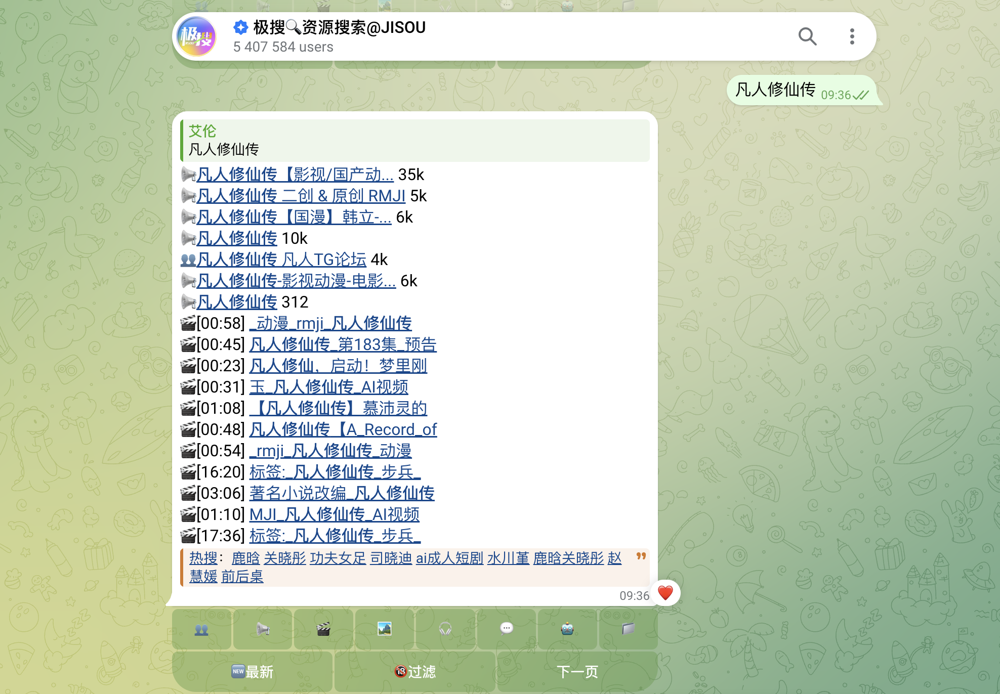
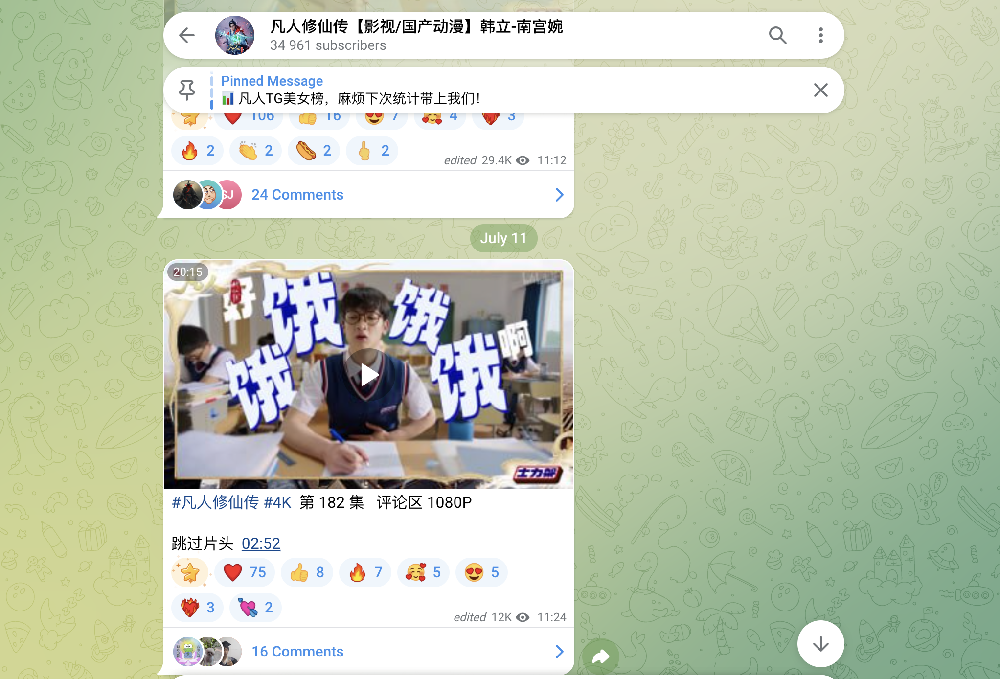

本文整理了一份艾伦测试过仍可用的 Telegram 搜索机器人，适合直接在 Telegram 内搜索影视、资源、成人内容、频道和群组入口。

## 为什么要用搜索机器人

不得不承认，telegram 群组里拥有大量免费的资源，这些资源如果通过互联网搜索引擎去搜索，很可能搜不出来，或者会遇到各种各样的限制，但是在 telegram 里面就很方便，毕竟这里什么资源都敢发，什么资源都有

## 什么时候用搜索机器人

Telegram 搜索机器人最常见的用途是：

- 搜影视资源、剧集、电影、视频和音乐
- 查找好看的频道、兴趣群组和内容集合
- 搜索成人内容、番号、资源下载入口
- 在 Telegram 内快速定位资源分享、文件和直播链接

这些机器人比打开浏览器更方便，它们收录了非常多的 telegram 群组，搜索引擎搜不出来的群组，可以通过搜索机器人搜出来。

## 如何使用

1. 点击下方的机器人入口链接，比如 [极搜bot](https://t.me/jisou2?start=a_597766375)。
2. 进入机器人对话界面，点击“开始”或发送 `/start`。
3. 在聊天框中输入你想要搜索的关键词。比如 

   再比如

   
   

**连视频会员的钱都省了**

## 常见搜索机器人合集

以下是我测试过仍可用的 Telegram 搜索机器人，功能上都差不都，但是不同的机器人搜录的群组不一样。
**如果一个机器人搜不出来想要的内容，不妨切换到另外一个机器人搜索来试试**

- [极搜bot](https://t.me/jiso?start=a_597766375)：Telegram 必备的搜索引擎，适合直接搜索群组、频道、视频、音乐等内容。
- [另一个极搜bot](https://t.me/jisou2?start=a_597766375)
  ：Telegram 必备的搜索引擎，适合直接搜索群组、频道、视频、音乐等内容。
- [搜搜bot](https://t.me/sosoo?start=a_597766375)：直接输入关键词搜索，适合想快速找到内容的场景。
- [神马搜索bot](https://t.me/smss?start=spread_597766375)：侧重 Telegram 内资料与资源搜索。
- [快搜bot](https://t.me/kuai?start=a_9VW7KM)：中文搜索引擎，适合查找有趣的群组、频道、视频、音乐。

## 持续更新

这篇文章会作为一个“持续更新”的列表，后续会补充更多可用的 Telegram 搜索机器人。你也可以把好用的机器人推荐给我，我会把它们补充到下一版。

如果你有更好的 Telegram 搜索机器人，欢迎留言或通过我的其他渠道告诉我，我会把高质量机器人收录进来。
